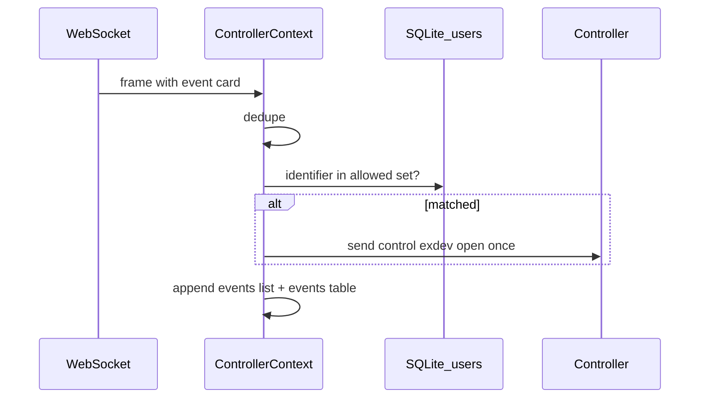

# Локальные пользователи контроллера и авторазблокировка по карте

## Контекст в коде

- Событие **предъявления идентификатора** уже типизировано как [`PercoEvent`](d:\проекты\new\PERCo-C01-Manager\types\events.ts) с `event: 'card'` и полями `card.id`, `card.number`, `card.direction` (номер и направление ИУ в формате API: `0 | 1`).
- Входящие кадры обрабатываются в [`ControllerContext.tsx`](d:\проекты\new\PERCo-C01-Manager\providers\ControllerContext.tsx) в `ws.onmessage`: после дедупликации событие добавляется в state и пишется в SQLite через [`eventsDb`](d:\проекты\new\PERCo-C01-Manager\utils\controller\eventsDb.ts).
- Команда однократного открытия ИУ уже задаётся в [`useControllerCommands.ts`](d:\проекты\new\PERCo-C01-Manager\hooks\useControllerCommands.ts) как `control` / `exdev` с `action: 'open'` и `open_type: 'open once'` (и `open_time`, по аналогии с экраном команд — разумный дефолт **1000** мс).

## 1. Хранилище пользователей (SQLite)

- Расширить слой БД: либо **экспортировать** общий доступ к той же БД `perco_events.db`, либо вызвать создание второй таблицы из существующего [`initEventsDb`](d:\проекты\new\PERCo-C01-Manager\utils\controller\eventsDb.ts), чтобы не открывать файл двумя независимыми путями.
- Новая таблица, например `local_access_users`:
  - `id INTEGER PRIMARY KEY AUTOINCREMENT`
  - `full_name TEXT NOT NULL`
  - `identifier TEXT NOT NULL UNIQUE`
- API модуля (новый файл, напр. [` utils/controller/localAccessUsersDb.ts`](d:\проекты\new\PERCo-C01-Manager\utils\controller\localAccessUsersDb.ts) или рядом с `eventsDb`):
  - `initLocalAccessUsersTable()` — `CREATE TABLE IF NOT EXISTS ...`
  - `listUsers()`, `insertUser(fullName, identifier)`, `updateUser(id, ...)`, `deleteUser(id)`
  - `getAllIdentifiersTrimmed(): Promise<Set<string>>` или поддержка **кэша**: `Set` в памяти + `refreshAllowedIdentifiersFromDb()` после CRUD
- **Сравнение идентификатора** (по вашему выбору): `String(stored).trim() === String(eventId).trim()`.

## 2. Авторазблокировка в `ControllerContext`

- После успешной дедупликации и **до** или **сразу после** `setEvents` / `insertEventToDb` для `msg.event === 'card'`:
  - Проверить, что `msg.card.id` (после trim) есть в кэше разрешённых идентификаторов.
  - Если да и сокет открыт — вызвать **`sendPayloadFireAndForget`** с телом как у `toggleExdevAction` для открытия:
    - `{"control":"exdev","exdev":{"number": card.number,"direction": card.direction,"action":"open","open_time":1000,"open_type":"open once"}}`
  - Логировать в transport log автоматически (уже делает `sendPayloadFireAndForget`).
- Инициализация кэша: в `ControllerProvider` после `init` таблицы пользователей вызвать `refreshAllowedIdentifiersFromDb()`.
- **Важно**: не блокировать `onmessage` тяжёлым I/O — при варианте «читать БД на каждое событие» оборачивать в `void ...`; предпочтительно **кэш + обновление при CRUD** на экране пользователей (и при старте приложения).

## 3. UI: [`app/controller/users.tsx`](d:\проекты\new\PERCo-C01-Manager\app\controller\users.tsx)

- Привести разметку к паттерну [`app/controller/config/readers.tsx`](d:\проекты\new\PERCo-C01-Manager\app\controller\config\readers.tsx) / [`exdev.tsx`](d:\проекты\new\PERCo-C01-Manager\app\controller\config\exdev.tsx): `createStyles` с `title`, `subtitle`, `FlatList`, `ItemSeparator`, при необходимости `InlineLoading` при первой загрузке.
- Список строк: новый компонент, напр. [`components/ui/blocks/accessUserLine.tsx`](d:\проекты\new\PERCo-C01-Manager\components\ui\blocks\accessUserLine.tsx) по аналогии с [`readerLine.tsx`](d:\проекты\new\PERCo-C01-Manager\components\ui\blocks\readerLine.tsx) (карточка, ФИО крупнее, идентификатор вторичным текстом, кнопка настроек/редактирования).
- Кнопка «Добавить» — `ButtonSquare` + существующая иконка (например `addReader` или `servers` из [`themedIcons`](d:\проекты\new\PERCo-C01-Manager\constants\themedIcons.ts)), без новых ассетов.
- [`ModalChildren`](d:\проекты\new\PERCo-C01-Manager\components\ui\status\ModalChildren.tsx) + контент модалки, напр. [`components/modal-content/accessUserEditModal.tsx`](d:\проекты\new\PERCo-C01-Manager\components\modal-content\accessUserEditModal.tsx):
  - поля `InputField`: ФИО, идентификатор;
  - «Сохранить», при редактировании — «Удалить» (с подтверждением через существующий паттерн проекта или простой `ModalText`/алерт);
  - после успешной операции: перезагрузить список, вызвать **`refreshAllowedIdentifiersFromDb()`** (экспортировать из DB-модуля).

## 4. Типы

- Минимальный тип записи, напр. в [`types/accessUser.ts`](d:\проекты\new\PERCo-C01-Manager\types\accessUser.ts): `{ id: number; fullName: string; identifier: string }`.

## 5. Ограничения и краевые случаи

- Авторазблокировка только при **активном WebSocket**; если офлайн — событие всё равно сохраняется в ленте/БД событий, команда не уходит (ожидаемое поведение).
- Не обрабатывать `pass_personal` / другие типы, если явно не согласовано (требование формулировалось как предъявление → `card`).
- Коллизии: `UNIQUE(identifier)` — при сохранении показать понятное сообщение об ошибке.

## Файлы (ожидаемые изменения)

| Область | Файлы |
|---------|--------|
| БД | [`eventsDb.ts`](d:\проекты\new\PERCo-C01-Manager\utils\controller\eventsDb.ts) (экспорт `getDb` / общий `init`) + новый модуль CRUD пользователей |
| Логика события | [`ControllerContext.tsx`](d:\проекты\new\PERCo-C01-Manager\providers\ControllerContext.tsx) |
| Экран | [`users.tsx`](d:\проекты\new\PERCo-C01-Manager\app\controller\users.tsx) |
| UI | новые `accessUserLine`, `accessUserEditModal` |
| Типы | `types/accessUser.ts` |
