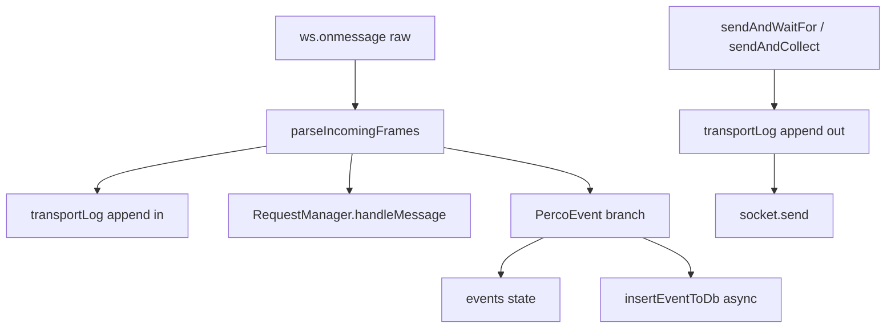

# Перестройка плана: фон и журнал WebSocket

## Какая была «архитектура в голове» и что уже есть в коде

Исходный план из [чата про события и фон](75ec8eda-b9dc-4c4c-8a15-c58005ec4625) предполагал: один `onmessage`, парсер склеенных JSON, маршрутизация `event` vs `answer`, `RequestManager`, хранилище событий, затем Android foreground service.

**Сейчас в репозитории уже реализовано:**

| Идея плана | Где в коде |
|------------|------------|
| Единый вход WebSocket | [`providers/ControllerContext.tsx`](d:/проекты/new/PERCo-C01-Manager/providers/ControllerContext.tsx) — `setGlobalSocket` → `ws.onmessage` |
| Парсер кадров | [`utils/controller/parseIncoming.ts`](d:/проекты/new/PERCo-C01-Manager/utils/controller/parseIncoming.ts) — `parseIncomingFrames` |
| Развод ответов команд | `requestManagerRef.current.handleMessage(msg)` в том же обработчике |
| События `PercoEvent` | Ветка `typeof msg.event === 'string'`: дедупликация, `setEvents`, вызов SQLite |
| Persistence | [`utils/controller/eventsDb.ts`](d:/проекты/new/PERCo-C01-Manager/utils/controller/eventsDb.ts) — `insertEventToDb` / загрузка при старте провайдера |
| Хуки без `addEventListener('message')` | В [`hooks/`](d:/проекты/new/PERCo-C01-Manager/hooks) прямых подписок на `message` нет; конфиг идёт через `sendAndWaitFor` / `sendAndCollect` контекста |

**«Фон» в смысле не блокировать UI:** запись в SQLite уже уходит асинхронно (`void insertEventToDb(...)`), то есть тяжёлое I/O не блокирует обработчик сообщения синхронно.

**Чего нет:** непрерывный приём при свёрнутом приложении на Android — в проекте **нет** foreground service / background task для удержания WebSocket (grep по коду не находит `ForegroundService`, `TaskManager` и т.п.).

---

## Сколько действий осталось (по смыслу старого плана событий)

Если считать задачи из того плана как чеклист:

1. **Роутер + парсер** — по сути **сделано** (в провайдере, без отдельного файла `messageRouter.ts`).
2. **EventBus / отдельный EventStore-модуль** — **не обязателен**: роль выполняют `events` в контексте + SQLite; выделение в отдельный модуль — только если нужна чище архитектура или подписки вне React.
3. **RequestManager + хуки** — **сделано**.
4. **UI событий** — **есть** ([`app/controller/events.tsx`](d:/проекты/new/PERCo-C01-Manager/app/controller/events.tsx), [`components/modal-content/logModal.tsx`](d:/проекты/new/PERCo-C01-Manager/components/modal-content/logModal.tsx) для сырых событий).
5. **Android: непрерывный фон** — **не сделано**; это **одно крупное оставшееся действие** плана (Expo prebuild / dev client + foreground service + UX включения и постоянной нотификации).

Итого по «фону событий» в изначальном смысле «работать при блокировке/сворачивании»: **осталась 1 основная работа** (нативный фон Android), плюс по желанию **полировка** (отдельный `eventStore.ts`, correlation-id для параллельных запросов одного типа).

---

## План по журналу WebSocket-трафика и как он стыкуется

План из [чата про полный обмен](acad23ba-af73-4179-940d-153011253b0d) предлагал:

- Кольцевой буфер записей `{ direction, ts, body }` в состоянии контекста + очистка.
- Обернуть **исходящие** отправки в одну функцию (`sendJson`): лог → `socket.send`.
- В **`onmessage`**: для **каждого** распарсенного кадра из `parseIncomingFrames` — запись в транспортный лог, **затем** нынешняя логика `RequestManager` и ветка `PercoEvent`.

**Сочетание с обработкой событий:**

- Транспортный лог и «бизнес-события» **не конфликтуют**: первый — все кадры; второй — только объекты с полем `event` + дедуп + SQLite.
- Риск дублей в UI решается раздельно: экран событий остаётся на `events`; модалка разработчика может переключаться «только push-события» vs «полный транспорт» или показывать оба раздела.

**Оставшиеся пункты именно журнала WS (по тому плану, код ещё не сделан):**

1. Состояние + запись **входящих** всех кадров и **исходящих** в [`ControllerContext.tsx`](d:/проекты/new/PERCo-C01-Manager/providers/ControllerContext.tsx) (сейчас логируются только push-события через `events`).
2. Убрать обход: прямой `socket.send` в [`hooks/useControllerCommands.ts`](d:/проекты/new/PERCo-C01-Manager/hooks/useControllerCommands.ts) (~строка 230) — иначе часть исходящих не попадёт в общий логгер.
3. Обновить [`components/modal-content/logModal.tsx`](d:/проекты/new/PERCo-C01-Manager/components/modal-content/logModal.tsx): направление, формат, лимит/очистка.
4. Опционально: колбэк логирования в [`utils/attemptConnection.ts`](d:/проекты/new/PERCo-C01-Manager/utils/attemptConnection.ts) для фазы до `setGlobalSocket`.

Итого по журналу: **3 обязательных + 1 опциональный** шага.

---

## Рекомендуемый порядок внедрения (если делать оба направления)

1. **Транспортный лог в контексте** (единая точка входа/выхода) — даёт отладку всего протокола без изменения семантики событий.
2. **Убрать прямой `send` в `useControllerCommands`** — чтобы журнал был полным.
3. **UI `LogModal`** под новый буфер.
4. Параллельно или после: **Android foreground service** как отдельный эпик (меняет сборку и разрешения), без обязательной связи с пунктами 1–3, кроме того что тот же `ControllerContext`/сокет должны жить в процессе, который сервис не убивает.

---

## Не путать с другим планом в репозитории

В [`.cursor/plans/c01_config_modules_completion_f8e63550.plan.md`](d:/проекты/new/PERCo-C01-Manager/.cursor/plans/c01_config_modules_completion_f8e63550.plan.md) лежит **другой** трек (конфиг-модули UI/hooks) — **5 pending** задач; к фону событий и WS-логу он почти не относится.
